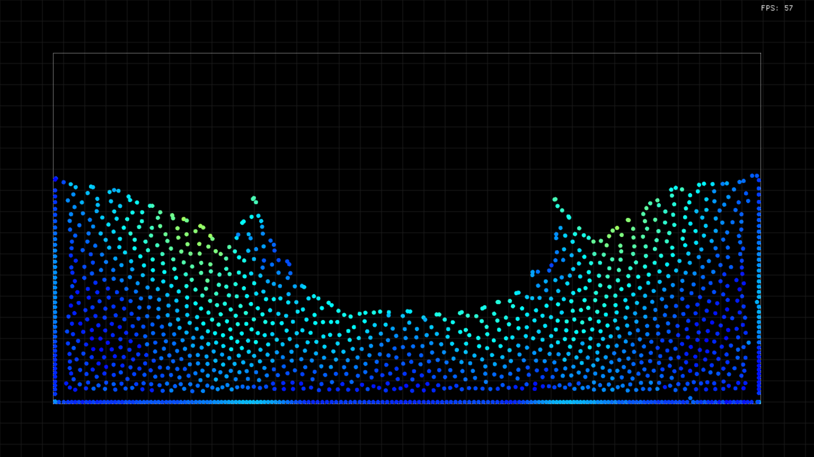

# Fluid Simulation

A 2D fluid simulation implemented in Rust using the Macroquad game engine. This simulation uses Smoothed Particle Hydrodynamics (SPH) to create realistic fluid behavior.



## Features

- Multiple fluid spawn modes: Random, Grid, and Gravity
- Interactive fluid manipulation (push and pull)
- Real-time physics simulation
- Configurable parameters for fluid behavior
- Fullscreen rendering with FPS counter

## Requirements

- Rust 1.75+ (2024 edition)
- Cargo (Rust's package manager)

## Dependencies

- [macroquad](https://github.com/not-fl3/macroquad) (0.4.14) - A cross-platform game engine
- [rayon](https://github.com/rayon-rs/rayon) (1.10.0) - Data parallelism library
- [uuid](https://github.com/uuid-rs/uuid) (1.16.0) - UUID generation

## Installation

1. Clone this repository:

   ```bash
   git clone https://github.com/Abots-jzm/fluid-simulation
   cd fluid-simulation
   ```

2. Build and run the project:

   ```bash
   cargo run --release
   ```

   The `--release` flag is recommended for better performance.

## Controls

- **Left Mouse Button**: Pull fluid particles
- **Right Mouse Button**: Push fluid particles
- **Space**: Pause/Resume simulation
- **Esc**: Exit application

## Configuration

The simulation behavior can be customized by modifying the `Config` struct in `config.rs`. Key parameters include:

- `particle_radius`: Size of each fluid particle
- `particle_count`: Total number of particles in the simulation
- `fluid_spawn_mode`: Initial distribution of particles (Random, Grid, Gravity)
- `gravity`: Force applied to particles
- `smoothing_radius`: Radius used for particle interactions
- `pressure_multiplier`: Strength of pressure forces
- `viscosity_strength`: Fluid thickness/stickiness

## How It Works

This simulation uses Smoothed Particle Hydrodynamics (SPH), a computational method for simulating fluid flows. The basic principle involves:

1. Dividing the fluid into discrete particles
2. Using spatial partitioning (grid) for efficient neighbor finding
3. Calculating density, pressure, and viscosity forces between particles
4. Integrating forces to update particle positions and velocities

## Performance

The simulation uses Rayon for parallel computation of particle interactions, significantly improving performance for large numbers of particles.

## License

This project is licensed under the MIT License - see the LICENSE file for details.
